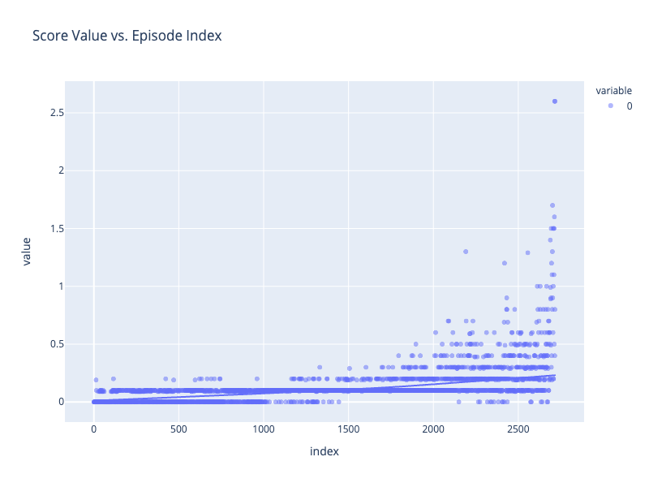

# Summary Report

## Learning Algorithm

## Multiple Agents 

By training two identical competing agents, we can benefit from sharing experience and combining the Replay Buffers as suggested.

### DDPG

The reinforcement algorithm [implemented here](ddpg_agent.py) is following from Deep Deterministic Policy Gradients. DDPG is an Actor-Critic reinforcement learning algorithm, and contains a neural network (NN) as the basis for each part.

#### Chosen Neural Network

Since the agent's observation space state can be represented as a single vector of size 24, simple two NNs have sufficed. They each have two fully connected hidden layers, with relu activation functions. The actor has an TanH activation function (for continuous variables) on the 2-action output, while the critic's output layer is a single value without any activation function.

Actor
- FC1: (input, 256) - ReLU
- FC2: (256, 128) - ReLU
- Output: (128, 4) - TanH

Critic
- FC1: (input, 256) - ReLU
- FC2: (256 + action_size, 128) - ReLU
- Output: (128, 1) - Linear

The implementation can be found in [model.py](model.py).

#### Hyperparameters

The hyperparameters used to train these saved weight files are as follows:

```
BUFFER_SIZE = int(1e5)  # replay buffer size
BATCH_SIZE = 512        # minibatch size
GAMMA = 0.99            # discount factor
TAU = 1e-3              # for soft update of target parameters
LR_ACTOR = 1e-4         # learning rate of the actor 
LR_CRITIC = 1e-4        # learning rate of the critic
WEIGHT_DECAY = 0        # L2 weight decay
```

## Plot of Rewards

Following from the [training notebook](Training.ipynb) we can see how the average scores of the agent increases with the number or episodes used for training.

### Solution

This figure shows the scores over the first ~2600 episodes, going from nothing to a solved model like `agent_1_first_score_actor_model.pth` & `agent_1_first_score_critic_model.pth`

**This demonstrates that the model solved the environment in 2617 episodes**, averaging a running score of 0.50.



## Ideas for Future Work

To improve the agent further, any of the following steps can be taken:
- optimize the hyperparamters by fine tuning or running a grid search over some search space. 
- try more complex neural nets
- try different values of `mu` and `sigma` in OUNoise
- implement D4PG and try solving Soccer environment
